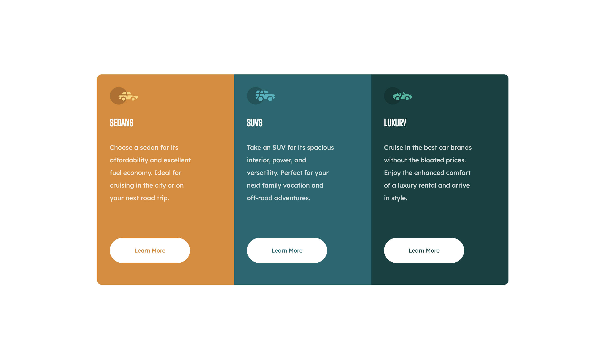

# Frontend Mentor - 3-column preview card component solution

This is a solution to the [3-column preview card component challenge on Frontend Mentor](https://www.frontendmentor.io/challenges/3column-preview-card-component-pH92eAR2-). Frontend Mentor challenges help you improve your coding skills by building realistic projects. 

## Table of contents

- [Overview](#overview)
  - [Screenshot](#screenshot)
  - [Links](#links)
- [My process](#my-process)
  - [Built with](#built-with)
- [Author](#author)

## Overview

### Screenshot

### Links

- Solution URL: [GitHub](https://github.com/Munegu/3-column-preview-card-frontend-challenge)
- Live Site URL: [GitHub Page](https://munegu.github.io/3-column-preview-card-frontend-challenge/)

## My process

### Built with

- Semantic HTML5 markup
- CSS custom properties
- Flexbox

## Author

- Website - [Munegu](https://github.com/Munegu)
- Frontend Mentor - [@Munegu](https://www.frontendmentor.io/profile/Munegu)
